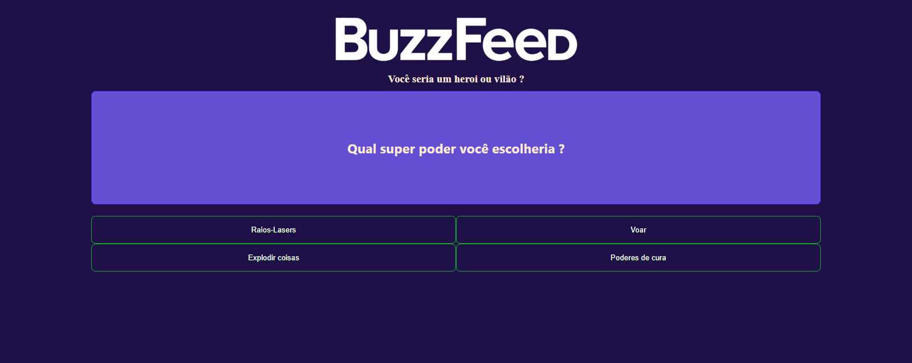

# Projeto Angular - Quiz estilo Buzzfeed 🧠✨

## 📌 Sobre o Projeto

Este projeto é um quiz interativo no estilo BuzzFeed, desenvolvido com Angular 18 e seus novos recursos standalone.  
O objetivo é responder a uma série de perguntas e, com base nas suas escolhas, descobrir se você seria um **herói ou um vilão**.

O projeto se destaca por ser inteiramente front-end, com lógica de decisão baseada em contagem de respostas — cada opção carrega um "alias" (`A` ou `B`) que influencia no resultado final.

> Projeto desenvolvido com fins educativos, voltado para praticar Angular standalone, componentização e manipulação de dados dinâmicos.

## 📸 Prévia

<div align="center">
  
</div>

> *Imagem ilustrativa da tela inicial do quiz “Você seria um herói ou vilão?”*

## 🛠 Tecnologias Utilizadas

- [Angular 18](https://angular.io/)
- Standalone Components
- Declarative Control Flow (`@if`, `@for`)
- TypeScript
- HTML5 e CSS3
- RxJS (básico)

## 🌐 Acesse Online

Confira a versão publicada via GitHub Pages:  
👉 [luis-fellipe.github.io/angular-buzzfeed-site](https://luis-fellipe.github.io/angular-buzzfeed-site/)

## ▶️ Como Executar

> Este projeto também pode ser executado localmente para fins de estudo. Veja abaixo:

Antes de iniciar, é necessário ter o Node.js instalado em sua máquina.

Depois, siga os passos abaixo:

```bash
# Clone o repositório
git clone https://github.com/Luis-Fellipe/angular-buzzfeed-site.git

# Acesse a pasta do projeto
cd angular-buzzfeed-site

# Instale as dependências
npm install

# Inicie o servidor de desenvolvimento
npm start
```

O projeto estará disponível em `http://localhost:4200`.

## 🔗 Linkedin

www.linkedin.com/in/luis-fellipe-real
